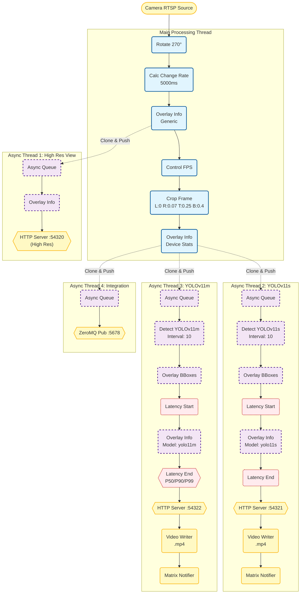

# Matrix Pipeline

MatrixPipeline is a modular, high-performance C++ computer vision application.
It utilizes a configurable Pipeline
Pattern that allows video frames (a.k.a. "matrix") flow through it.

This architecture creates a "T-junction" flow: lightweight tasks like rotation
and cropping run in real-time, while
heavy operations—such as YOLOv11 object detection, MP4 encoding, and network
I/O—are offloaded to isolated threads to
prevent frame drops. Key capabilities include multi-resolution MJPEG streaming,
motion-triggered recording, Matrix chat
alerts, and ZeroMQ broadcasting, all defined via a flexible JSON configuration.



## Dependencies

- [vcpkg.json](./vcpkg.json)
- `v4l-utils`: for manually examining and manipulating local video devices.
- `OpenCV`: Check build notes [here](etc/build-notes.md)
  and [here](https://github.com/alex-lt-kong/the-nitty-gritty/tree/main/c-cpp/cpp-only/06_poc/05_cuda-vs-ffmpeg).
- [TensorRT](https://developer.nvidia.com/tensorrt/download)

## Build and deployment

```bash
mkdir ./build
cmake ../
make -j2
```

## Quality assurance

- Instead of `cmake ../`, run:

    - `cmake -DBUILD_ASAN=ON ../`
    - `cmake -DBUILD_UBSAN=ON ../`

- The repo is also tested with `Valgrind` from time to time:
  `valgrind --leak-check=yes --log-file=valgrind.rpt ./build/cs`.

## Profiling

- gprof:

```bash
cmake -DCMAKE_CXX_FLAGS=-pg -DCMAKE_EXE_LINKER_FLAGS=-pg -DCMAKE_SHARED_LINKER_FLAGS=-pg  ../
make -j4
./build/cm
gprof ./build/cm gmon.out
```

- callgrind

```
valgrind --tool=callgrind ./cm
kcachegrind `ls -tr callgrind.out.* | tail -1`
```
